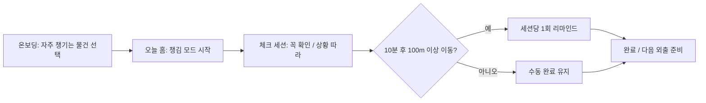

<div align="center">

# 챙김돌 ChaenggimDol

**외출 직전, 놓치기 쉬운 물건을 다정하게 한 번 더 확인해 주는 로컬 우선 Android 앱**

챙김돌은 사용자가 직접 시작한 `챙김 세션` 동안 체크리스트를 보여주고, 이동이 감지되면 세션당 한 번 더 확인 알림을 보내는 작은 수호돌입니다.

[](#기술-구성)
[](#privacy-by-design)
[](#mvp-범위)

</div>

---

## 한눈에 보는 온보딩

| 1. 물건 고르기 | 2. 출발 전 확인 | 3. 이동 후 리마인드 |
|---|---|---|
| 휴대폰, 지갑, 이어폰처럼 자주 챙기는 물건을 선택합니다. | 외출 직전 `챙김 모드`를 시작해 꼭 확인/상황 따라 물건을 체크합니다. | 세션 중 10분 이후 시작점에서 100m 이상 이동한 것으로 보이면 한 번만 알려줍니다. |



---

## 왜 만들었나

외출 직전의 실수는 거창한 기능보다 **짧고 확실한 확인 루틴**으로 줄일 수 있습니다. 챙김돌은 분실물 검색 서비스나 서버 기반 추적보다 먼저, 실제 사용자가 매일 쓸 수 있는 로컬 체크 경험에 집중합니다.

- **빠른 진입**: 앱을 열면 바로 오늘 챙길 물건과 CTA가 보입니다.
- **비난하지 않는 말투**: 놓친 물건을 혼내지 않고 다정하게 상기합니다.
- **권한 최소화**: 위치 권한이 없어도 수동 체크리스트는 동작합니다.
- **포트폴리오 포인트**: Compose UI, Room, DataStore, foreground location service, 접근성/프라이버시 설계를 한 MVP 안에 담았습니다.

---

## Signal Buddy 디자인

챙김돌의 시각 콘셉트는 `어반 시그널 65% + 다정한 수호돌 35%`입니다.

| 토큰 | 색상 | 역할 |
|---|---|---|
| Charcoal | `#171914` | 본문, 아이콘, 높은 대비 |
| Signal Lime | `#D7FF3F` | 주요 CTA와 확인 상태 |
| Buddy Coral | `#FF7478` | 챙김돌 캐릭터 |
| Pine Teal | `#2E6B5F` | 보조/선택 상태 |
| Soft Sage | `#EAF3DF` | 기본 배경 |

자세한 규칙은 [`docs/DESIGN.md`](docs/DESIGN.md)를 참고하세요.

---

## MVP 범위

- 기본 물품을 고르는 온보딩
- 물품 추가·활성화·삭제
- 수동 체크리스트 세션과 미확인 종료 확인
- 세션 중에만 실행되는 위치 포그라운드 서비스
- 10분 이후 시작점에서 100m 이상 이동했을 때 세션당 1회 알림
- 위치·알림 권한이 없어도 가능한 수동 완료 흐름
- 로컬 데이터 전체 삭제

> Phase 1에는 LOST112, 날씨, 서버, FCM, 블루투스 태그, 백그라운드 위치 권한이 없습니다.

---

## 기술 구성

| 영역 | 사용 기술 | 구현 포인트 |
|---|---|---|
| UI | Kotlin, Jetpack Compose, Material 3 | 온보딩/홈/세션/내 물건/설정 화면 |
| 상태 관리 | ViewModel, StateFlow | 화면별 단방향 상태 흐름 |
| 로컬 저장 | Room | 물품과 챙김 세션 저장 |
| 설정 | Preferences DataStore | 온보딩 완료, 위치 감지 설정 |
| 위치 감지 | Google Play services Location | 사용자가 시작한 세션에서만 foreground service 실행 |
| 테스트 | JUnit, Compose UI test | 도메인 정책, ViewModel, 접근성 흐름 검증 |

---

## Privacy by Design

챙김돌은 로컬 우선 MVP입니다.

- 서버가 없습니다.
- 위도·경도를 Room이나 로그에 저장하지 않습니다.
- 시작 위치와 최신 판단 값은 위치 서비스가 살아 있는 동안 메모리에서만 사용합니다.
- 위치 추적은 사용자의 명시적 시작 이후에만 동작하고 세션 종료 시 멈춥니다.
- 위치 권한 없이도 수동 체크리스트는 사용할 수 있습니다.

---

## 프로젝트 구조

```text
app/src/main/java/com/yuseob/chaenggimdol
├── data          # Room, DataStore, repository 구현
├── domain        # item/session use case와 순수 도메인 모델
├── location      # foreground location session controller
├── navigation    # Navigation 3 route 구성
├── notification  # reminder notification channel/notifier
└── ui            # Compose screens, theme, reusable components
```

---

## 실행

Android Studio에서 프로젝트를 열거나 다음 명령을 사용합니다.

```bash
./gradlew assembleDebug
./gradlew installDebug
```

로컬 SDK 경로는 Git에 포함되지 않는 `local.properties`에 설정해야 합니다.

---

## 검증

```bash
./gradlew testDebugUnitTest
./gradlew lintDebug
./gradlew assembleDebug
./gradlew connectedDebugAndroidTest
```

세부 수동 검증 항목은 [`docs/MANUAL_QA.md`](docs/MANUAL_QA.md)를 참고합니다.

---

## 문서

- [`docs/DESIGN.md`](docs/DESIGN.md): Signal Buddy 디자인 계약
- [`docs/MANUAL_QA.md`](docs/MANUAL_QA.md): 수동 QA 체크리스트
- [`docs/PHASE1_RELIABILITY_PRD.md`](docs/PHASE1_RELIABILITY_PRD.md): Phase 1 신뢰성 PRD
- [`docs/index.html`](docs/index.html): GitHub Pages용 포트폴리오 랜딩 초안
